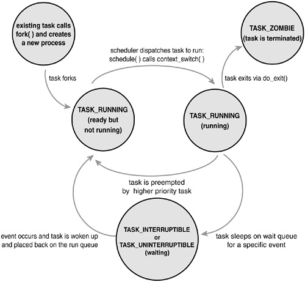

『阿男的Linux内核世界』＊07 process的各种状态＊

# 我们在上一篇文章学习了zombie process的保留原因，是因为kernel要管理这些processes，就需要管理和维护它们的各种状态。而当process退出的时候，这种「退出」实际上也是一种状态，因此kernel会释放掉这个process所占有的所有资源，但给这个process保留一个壳，也就变成了zombie process。

kernel维护和管理process的状态是非常重要的，因为这里会涉及到好多问题，比如`Process Scheduler`，还有`Synchronization`等方面的内容。关于这些方面的内容，阿男后续都会为大家介绍。

关于Linux下process的各种状态，以下是一张说明图：

我们从上图中可以看到，process的生命从fork开始，到`TASK_ZOMBIE`状态结束。中间是process运行的生命周期，包括`TASK_RUNNING`还有`TASK_INTERRUPTIBLE`和`TASK_UNINTERRUPTIBLE`等等。

因为Linux是一个多任务操作系统，一个系统里面同时跑着很多个processes，这和早期的DOS操作系统是很不同的。DOS实际上是个非常简单的操作系统，并没有多任务的能力，也就是说，在DOS系统下，同一时间只会运行一个程序。当我们在DOS下执行一个程序的时候，这个程序会占用全部的资源，接管机器的运行，直到退出后，操作系统重新接管电脑。所以这也是为什么我们在DOS系统下，经常会遇到「死机」，然后只能开关机，或者使用机箱上过去的RESET按键来重新启动操作系统。

但是在Linux下就不同了，Linux作为一个多任务的操作系统，并不会让某个process独占资源，完全接管计算机。可以说，在Linux下的每个process，都是运行在一个「虚拟机」里面的。比如：每一个process看到的都是自己的独立的内存空间，而kernel自己来管理实际的物理内存。

此外，每一个process都「认为」自己是在连续的运行，但实际上kernel会负责调度processes，并不会让一个process一直运行下去，而是根据process的运行情况和调度算法，把计算机的资源「公平地」分配给各个processes。

有的时候，高优先级的process会打断低优先级的process执行，因此低优先级的process就会从`TASK_RUNNING`的状态变成等待的状态，这些都是`Process Scheduler`要做的事情。

此外，不同的process可能互相之间需要协调执行顺序，比如process 1想等process 2执行完成后，再继续执行下去，这个时候也需要查询process的状态，这就是`Synchronization`的范畴。

因此kernel维护process的各种状态，是由于它是多任务操作系统这个本质决定的。包括现在的Windows NT内核，也是类似的设计，因为Windows现在也早已经是多任务操作系统了，这和早期的Windows 3.1等等在单任务系统里「模拟」出来的多任务系统有本质不同。

这篇文章就讲到这里吧，阿男下篇文章准备带大家继续代码，玩一玩`waitpid`。