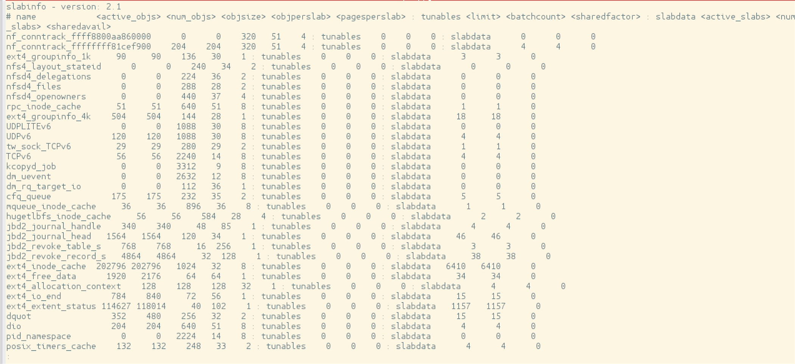

『阿男的Linux内核世界』＊18 Kernel的动态内存管理Slab Allocator＊

Linux Kernel有自己的动态内存管理机制，叫做`Slab Allocator`，它可以预先把计算机的实际内存空间给划分成固定大小的区块，然后把这些区块分配给请求内存的各个Process使用。

我们可以通过`/proc/slabinfo`来看到Kernel此时把内存划分的区块：

```c
$ sudo cat /proc/slabinfo | less
```

执行上面代码得到结果如下：



图片可能看不清楚，简单摘抄几行输出：

```bash
slabinfo - version: 2.1
# name            <active_objs> <num_objs> <objsize> <objperslab> <pagesperslab> : tunables <limit> <batchcount> <sharedfactor> : slabdata <active_slabs> <num_slabs> <sharedavail>
nf_conntrack_ffff8800aa860000      0      0    320   51    4 : tunables    0    0    0 : slabdata      0      0      0
buffer_head       412100 459966    104   39    1 : tunables    0    0    0 : slabdata  11794  11794      0
vm_area_struct     20267  20680    184   44    2 : tunables    0    0    0 : slabdata    470    470      0
files_cache          230    230    704   46    8 : tunables    0    0    0 : slabdata      5      5      0
signal_cache         570    570   1088   30    8 : tunables    0    0    0 : slabdata     19     19      0
sighand_cache        312    345   2112   15    8 : tunables    0    0    0 : slabdata     23     23      0
task_struct          364    384   7552    4    8 : tunables    0    0    0 : slabdata     96     96      0
```

我们看内存划分的标题：

```c
# name            <active_objs> <num_objs> <objsize> <objperslab> <pagesperslab> : tunables <limit> <batchcount> <sharedfactor> : slabdata <active_slabs> <num_slabs> <sharedavail>
```

可以看到Kernel把内存划分成不同的用途，用`name`来区分，然后是`active_objs`，从名字应该可以看出就是正在活跃的区块，就是已经被请求走，在使用的区块。`num_objs`应该就是Kernel已经划分好的区块总数。`objsize`就是这个类型的区块的块大小。每种类型的数据可能需要的内存基本单元大小不同，因此`objsize`适合不同的内存需求。

我们在使用标准C库提供给我们的`malloc`函数请求内存的时候，实际上User Space的`malloc`封装的事`kmalloc`这个Kernel函数，`kmalloc`最终调用`kmem_getpages`来从Slab Allocator的内存区块池里取得内存。
